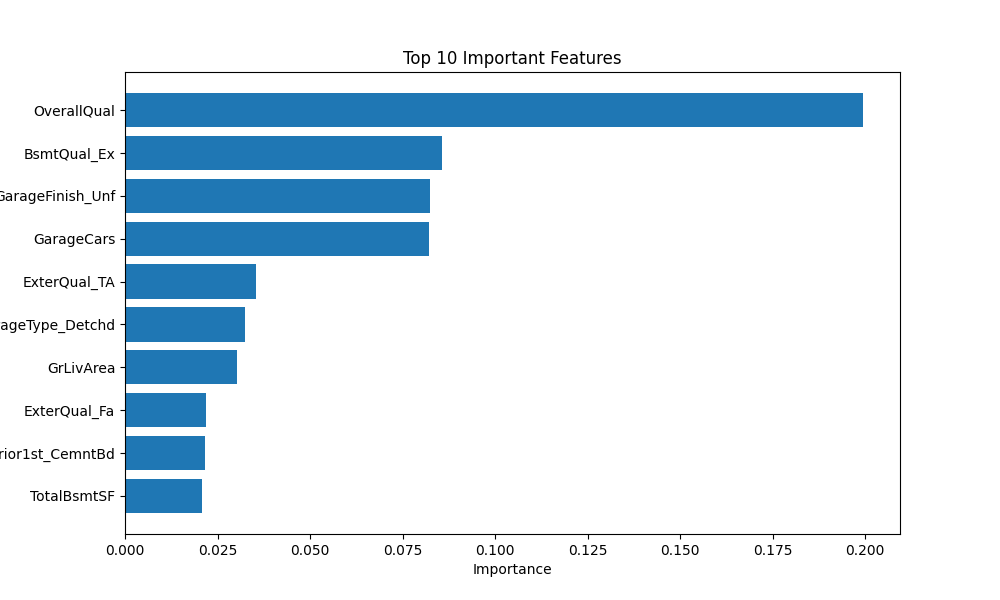

# 🏠 House Price Prediction

Machine Learning project for predicting house prices using the Ames Housing dataset from Kaggle.

## 📌 Project Overview

This project builds an end-to-end machine learning pipeline to predict house prices based on housing features such as quality, living area, garage capacity, and basement characteristics.

## ⚙️ Technologies Used

- Python
- Pandas
- Scikit-learn
- XGBoost
- Matplotlib

## 📊 Workflow

1. Data Cleaning
2. Missing Value Handling
3. Feature Encoding
4. Model Training
5. Cross Validation
6. Feature Importance Analysis
7. Model Evaluation

## 🤖 Models Used

- Random Forest Regressor
- XGBoost Regressor

## 📈 Results

- Average Cross Validation R²: ~0.87
- Final R² Score: ~0.86
- MAE: ~16k

## 📷 Feature Importance

## 📂 Dataset

Ames Housing Dataset from Kaggle:
https://www.kaggle.com/competitions/house-prices-advanced-regression-techniques

## 🚀 Future Improvements

- Hyperparameter tuning
- Deployment with Flask/Streamlit
- Advanced feature engineering